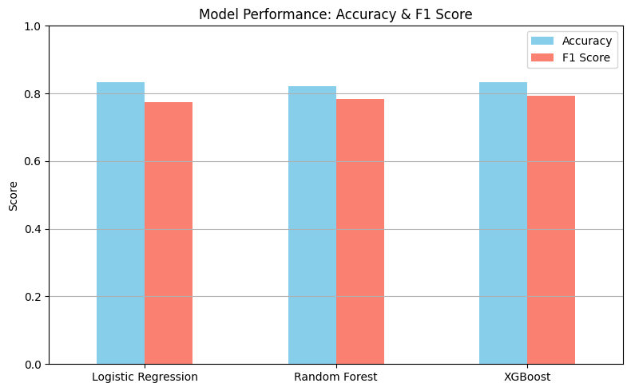
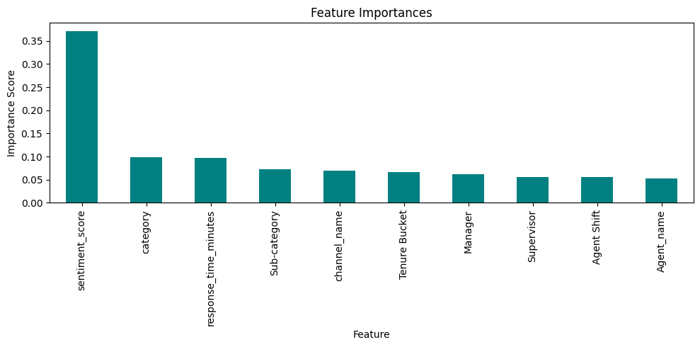
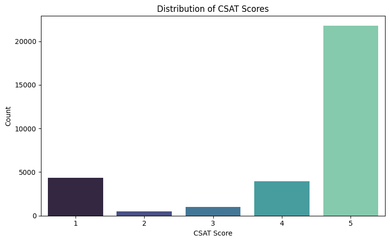
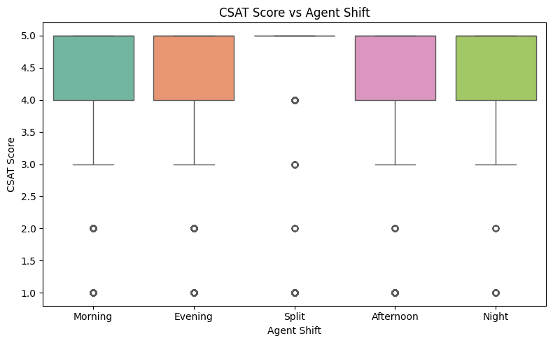
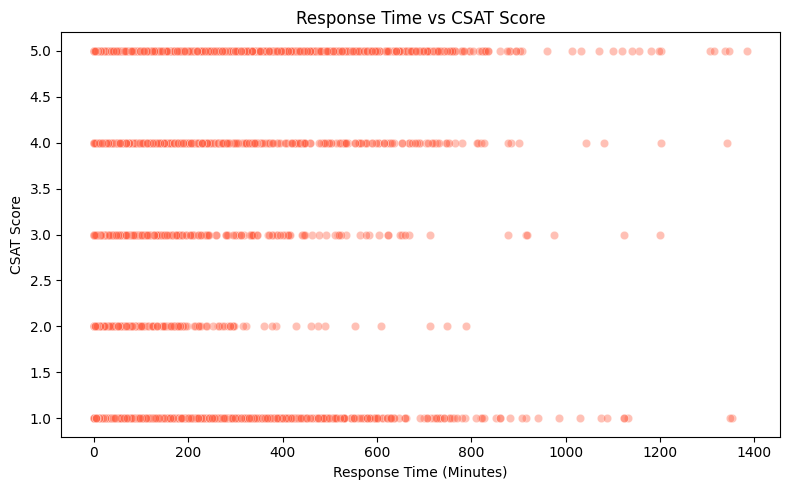
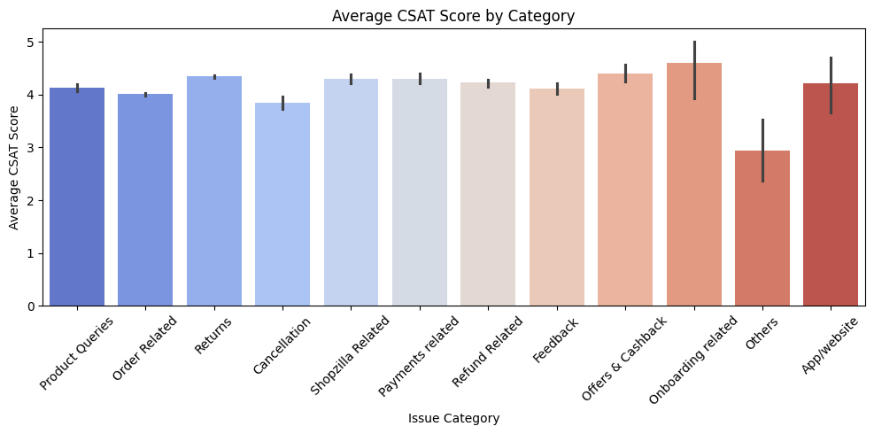
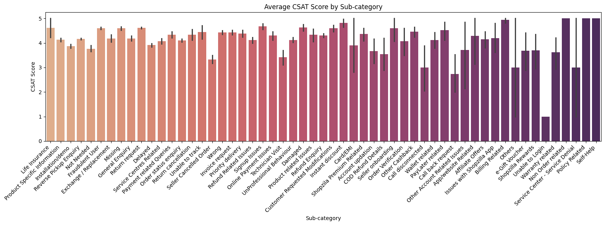
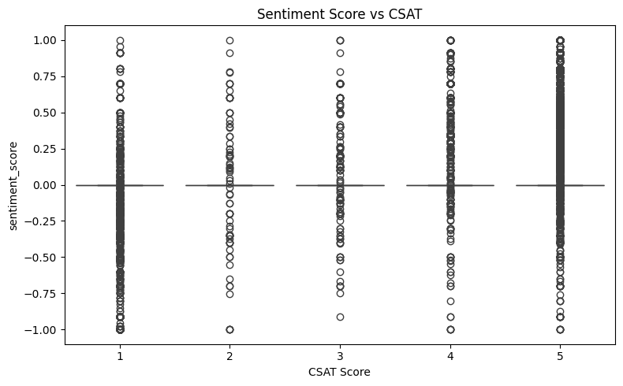
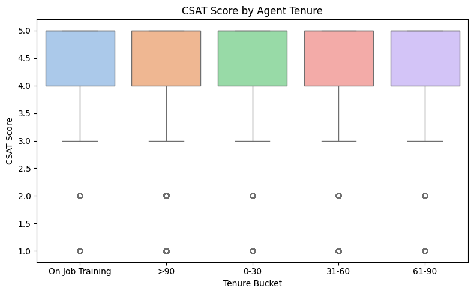
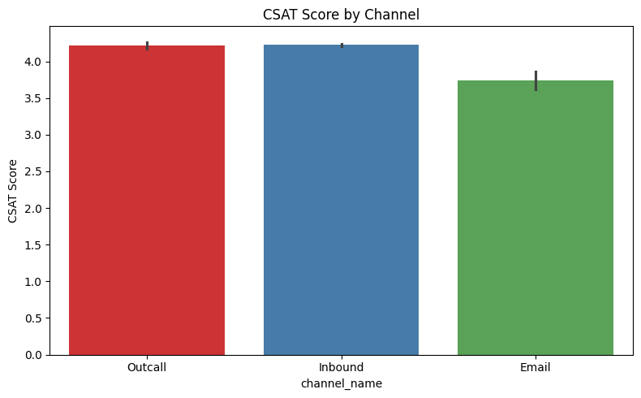

# Flipkart CSAT Prediction 📦🤖

This project uses machine learning and NLP to predict customer satisfaction (CSAT) based on Flipkart's customer support interaction data.

## 🔍 Project Features
- Sentiment analysis using TextBlob
- ML model training (XGBoost, Random Forest, Logistic Regression)
- CSAT class prediction (High/Medium/Low)
- Feature importance visualization
- Hypothesis testing for business insights

## 📁 Files
- `Flipkart_CSAT_Advanced.ipynb` – Main project notebook
- `best_model.pkl` – Trained XGBoost model
- `README.md` – Project description
- `requirements.txt` – Dependencies

## 📊 Sample Visualizations

### 🔹 Model Performance


### 🔹 Feature Importance


### 🔹 CSAT Score Distribution


### 🔹 CSAT Score vs Agent Shift


### 🔹 Response Time vs CSAT Score


### 🔹 Average CSAT Score by Category


## 🔹 Average CSAT Score by Sub Category


### 🔹 Sentiment Score vs CSAT


### 🔹 CSAT Score vs Agent Tenure


### 🔹 CSAT Score by Channel



## 🚀 How to Run
```bash
pip install -r requirements.txt
streamlit run csat_app.py


